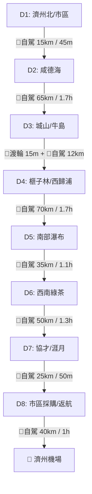

---
{"dg-publish":true,"permalink":"/logistics-handbook/","title":"🚗 濟州島自駕與交通資訊手冊 (Logistics Handbook)","tags":["交通","自駕","退稅"],"dg-note-properties":{"title":"🚗 濟州島自駕與交通資訊手冊 (Logistics Handbook)","tags":["交通","自駕","退稅"]}}
---

# 🚗 濟州島自駕旅行資訊手冊 (Logistics Handbook)

*(真實相片：濟州島城山綠色火山海岸)*

### ✈️ 8天7夜自駕環島：精密行程安排與行車交通指南 (舊版草案，僅供導航/停車參考)
**日期**：2026年9月26日 － 2026年10月3日（舊版，現行行程請見 6天5夜主行程表）  
**自駕路線**：順時針環島自駕 🚗  

> [!WARNING] **⚠️ 版本說明（2026-07-26 更新）**
> 本手冊為 **7/15 產出的 8天7夜草案**，行程已於 7/22 調整為 **[[01_旅程規劃 (Trips)/2026-09 濟州島自然與風情之旅/2026-09 濟州島自然與風情之旅\|2026-09 濟州島自然與風情之旅]] 的 6天5夜版本**（09/28-10/03，前4天經濟小車、後2天敞篷車），日期範圍與每日順序均不同。
> 現行的正式每日排程請以主行程表 [[01_旅程規劃 (Trips)/2026-09 濟州島自然與風情之旅/2026-09 濟州島自然與風情之旅\|2026-09 濟州島自然與風情之旅]] 為準；本手冊仍可作為**行車導航指引、停車資訊與避坑細節**的參考資料庫。

## 📊 旅程總覽與綜合預算規劃 (Summary)

### 🗺️ 環島自駕路線與每日交通推移圖

### 💵 8天預算分類彙整
| 類別 | 預估金額 (TWD/雙人) | 佔比 | 說明 |
| :--- | :--- | :--- | :--- |
| **🏨 住宿費** | $17,700 TWD | 39.5% | 7晚特色海景飯店與設計民宿 |
| **🍱 餐飲費** | $14,900 TWD | 33.3% | 黑豬肉烤肉、海鮮鍋、鮑魚粥、綠茶下午茶 |
| **🚗 交通費** | $10,250 TWD | 22.9% | 8天自駕租車、全險、油錢、牛島船票與三輪車租借 |
| **🎟️ 門票玩樂** | $1,925 TWD | 4.3% | 日出峰、萬丈窟、生態火車、手工皂手作與翰林公園門票 |
| **💰 總計** | **$44,775 TWD** | **100%** | **雙人環島總開銷 (人均約 $22,400 TWD)** |

---

## 🎒 出發前關鍵檢查清單
- [ ] 護照正本（效期需大於6個月）
- [ ] 中華民國駕照正本 ＆ **國際駕照正本 (認明B類蓋章)**
- [ ] 預訂確認信：機票、租車、7晚飯店 PDF 存手機
- [ ] 韓國網路卡 (eSIM / 實體卡) 已開通
- [ ] 信用卡（需開啟海外實體卡刷卡與退稅功能）
- [ ] 韓元現金（換匯約 300,000 KRW，小吃攤與部分門票收現）
- [ ] 電轉接頭（韓國雙圓頭，直徑4.7mm為佳）

---

## 🌦️ 天氣與穿搭建議 (9/28-10/3)
* **氣溫**：秋季濟州約 15-25°C，日夜溫差大，早晚沿海風勢明顯偏涼，建議洋蔥式穿搭（薄長袖＋防風外套）。
* **降雨/颱風**：9月底-10月初已過颱風最活躍期（8-9月為高峰），但仍非零風險，出發前1週建議追蹤氣象廳與颱風動態，並確認機票/租車的更改政策以防萬一。
* **防曬與防風**：海岸行程多（龍頭海岸、涉地可支、涯月等），秋陽仍強，建議帶防曬與帽子；敞篷車兩天風大，長髮建議綁起、備防風外套。

## ☎️ 緊急聯絡與實用資訊
| 項目 | 內容 |
| :--- | :--- |
| **警察報案** | 112（可英語轉接） |
| **消防／救護車** | 119 |
| **觀光通譯諮詢熱線（多國語言，含醫療/安全/申訴轉接）** | 1330 |
| **外國人綜合諮詢中心（簽證/入出境問題，20種語言）** | 1345（平日09:00-22:00，18:00後僅韓英中） |
| **駐韓國台北代表部（首爾）** | 辦公室 +82-2-6329-6000（上班時間週一至週五 09:00-11:30、13:30-15:30）／**急難救助專線 +82-10-9080-2761**（僅供緊急事件使用） |
| **插座規格** | 220V，C/F雙圓頭（韓國制式），台灣電器需轉接頭 |
| **小費文化** | 韓國餐廳、計程車、飯店普遍**不需小費** |
| **貨幣兌換** | 機場匯率通常較差，建議市區明洞風格換錢所或先在台灣換好部分韓元；信用卡（Visa/Master）在多數商店可用，傳統市場與小吃攤仍以現金為主 |
| **網路** | eSIM（如 airalo／KKday）出發前線上開通最方便；實體SIM卡可在機場櫃檯領取 |

## 📅 Day 1 - 抵達濟州與市區探索 (9/26)
*   **今日行程安排**：自駕取車 ➡️ 新羅舒泰酒店 ➡️ 龍頭岩 ➡️ 龍淵吊橋 ➡️ 東門傳統市場。
*   **本日預算**：$4,450 TWD
*   **交通方式**：🚗 自駕 18公里，開車總時長約 45分鐘。

### ⏱️ 精密交通與時間表 (自駕總里程：18公里)
*   **12:00 - 13:00** | 🛫 **【航班/入境】** 班機降落，辦理快速入境。
*   **13:00 - 13:30** | 🚶 **【交通接駁】** 步行前往機場 5 號出口對面停車場的租車接駁車站 (Shuttle Stop)。
*   **13:30 - 13:50** | 🚌 **【接駁巴士】** 搭乘 Lotte Rent-a-car 接駁車至取車中心 (車程 10 分鐘，等車 10 分鐘)。
*   **13:50 - 14:30** | 📝 **【自駕取車】** 櫃檯確認保險 (保 Super CDW 全險)，檢查車況並全車錄影，在 Naver Map 輸入電話導航。
*   **14:30 - 15:00** | 🚗 **【自駕路線 1】** 租車中心 ➡️ 濟州市區飯店 (Shilla Stay Jeju)。
    *   *導航指引*：走空港路 ➡️ 蓮三路 (7.5公里)。預估車程 20-30 分鐘，市區車流多注意限速。
    *   *🅿️ 停車*：停在飯店地下機械/平面停車場。
*   **15:00 - 15:30** | 🏨 **【辦理入住】** 辦理 Check-in，放妥行李。
*   **15:30 - 15:50** | 🚗 **【自駕路線 2】** 飯店 ➡️ 龍頭岩。
    *   *導航指引*：西光路 ➡️ 龍潭路 (4.8公里)，預估車程 15 分鐘。
    *   *🅿️ 停車*：龍頭岩公有免費停車場。
*   **15:50 - 17:00** | 🚶 **【景點徒步】** 參觀龍頭岩，沿著海岸步道步行至龍淵吊橋 (散步約 800 公尺，停留 1 小時)。
*   **17:00 - 17:20** | 🚗 **【自駕路線 3】** 龍淵吊橋 ➡️ 東門傳統市場。
    *   *導航指引*：興路 ➡️ 觀德路 (2.2公里)，預估車程 10 分鐘。
    *   *🅿️ 停車*：東門市場公有立體停車場 (收費，前 30 分鐘免費，後續每 30 分鐘 500 KRW)。
*   **17:20 - 20:30** | 🍱 **【美食市集】** 步行逛東門傳統市場。吃現切帶魚刺身、起司龍蝦與黑豬肉捲，買漢拿峰柑橘汁。
*   **20:30 - 20:50** | 🚗 **【自駕路線 4】** 東門市場 ➡️ 飯店 (3.5公里，車程 15 分鐘)。

---

## 📅 Day 2 - 東部咸德果凍海與山海漫步 (9/27)
*   **今日行程安排**：飯店 ➡️ 咸德海水浴場 ➡️ 犀牛峰步道 ➡️ 萬丈窟 ➡️ 月汀里海灘 ➡️ 城山飯店。
*   **本日預算**：$5,850 TWD
*   **交通方式**：🚗 自駕 65公里，開車總時長約 1.7小時。

### ⏱️ 精密交通與時間表 (自駕總里程：65公里)
*   **09:00 - 09:30** | 🏨 **【辦理退房】** 辦理退房，行李裝車。
*   **09:30 - 10:10** | 🚗 **【自駕路線 1】** 濟州市區飯店 ➡️ 咸德海水浴場。
    *   *導航指引*：繁榮路 ➡️ 一周東路 ➡️ 朝咸海岸路 (19.8公里)。車程 35-40 分鐘。
    *   *🅿️ 停車*：咸德海水浴場大型免費公有停車場。
*   **10:10 - 11:30** | 🏖️ **【海景漫步】** 漫步海灘，在 Cafe Delmoondo 享用麵包與冰美式，眺望翠綠果凍海。
*   **11:30 - 12:40** | 🚶 **【登山步道】** 攀爬沙灘旁的犀牛峰步道，沿土路緩坡爬升，俯瞰整片月牙灣海景 (往返約 2.5 公里，費時 1 小時 10 分鐘)。
*   **12:40 - 13:40** | 🍱 **【海鮮午餐】** 在海邊人氣海女餐廳享用鮑魚粥與烤鯖魚。
*   **13:40 - 14:10** | 🚗 **【自駕路線 2】** 咸德海水浴場 ➡️ 萬丈窟。
    *   *導航指引*：一周東路 ➡️ 金寧路 ➡️ 萬丈窟路 (14.2公里)。車程 25-30 分鐘。
    *   *🅿️ 停車*：萬丈窟景區免費停車場。
*   **14:10 - 15:40** | 🚶 **【熔岩洞探險】** 穿上外套，進入萬丈窟熔岩隧道。沿碎石路前行，參觀熔岩石柱 (往返 2 公里，費時 1.5 小時)。
*   **15:40 - 16:00** | 🚗 **【自駕路線 3】** 萬丈窟 ➡️ 月汀里海灘。
    *   *導航指引*：萬丈窟路 ➡️ 行院路 (7.5公里)，車程 15 分鐘。
    *   *🅿️ 停車*：月汀里海灘路邊免費停車位。
*   **16:00 - 17:30** | ☕ **【海景下午茶】** 坐在彩虹木椅上，以風車與日落為背景拍照。在海景咖啡廳享受午茶。
*   **17:30 - 18:15** | 🚗 **【自駕路線 4】** 月汀里 ➡️ 城山飯店。
    *   *導航指引*：一周東路 ➡️ 日出路 (22公里)，開車 40-45 分鐘，沿途多區間測速。
    *   *🅿️ 停車*：停在飯店專用停車場。
*   **18:15 - 18:45** | 🏨 **【辦理入住】** 辦理 Check-in，放行李。
*   **18:45 - 20:30** | 🥩 **【黑豬肉晚餐】** 開車 5 分鐘至城山「黑豚GO」，享用正宗炭火厚切黑豬肉烤肉。

---

## 📅 Day 3 - 城山日出峰與牛島探險 (9/28)
*   **今日行程安排**：飯店 ➡️ 城山日出峰 ➡️ 城山港 ➡️ 渡輪 ➡️ 牛島天津港 (租電動三輪車環島) ➡️ 渡輪返回 ➡️ 涉地可支 ➡️ 飯店。
*   **本日預算**：$4,990 TWD
*   **交通方式**：🚗 自駕 12公里/開車30分，🚢 渡輪往返 30分，🛵 三輪電動車環島 12公里。

### ⏱️ 精密交通與時間表 (自駕里程：12公里，船程往返：30分鐘)
*   **08:00 - 08:10** | 🚗 **【自駕路線 1】** 飯店 ➡️ 城山日出峰 (2.1公里，開車 5 分鐘)。
    *   *🅿️ 停車*：日出峰收費停車場 (小車 2,000 KRW)。
*   **08:10 - 10:00** | 🚶 **【火山登山】** 攀登城山日出峰。沿木棧台階爬升 180 米登頂，觀賞火山口 (往返 1.5 公里，費時 1.5 小時)。下山至左側海灘看礁石與海女秀。
*   **10:00 - 10:15** | 🚗 **【自駕路線 2】** 日出峰 ➡️ 城山港 (3.2公里，車程 8 分鐘)。
    *   *🅿️ 停車*：車子停在城山港立體停車場 (一日封頂 8,000 KRW)，自駕車不上船。
*   **10:15 - 10:45** | 🎫 **【渡輪購票】** 售票處填寫兩份乘船單，出示護照買往返牛島票。
*   **10:45 - 11:15** | 🚢 **【渡輪航行】** 乘船至牛島天津港 (船程 15 分鐘，等候 15 分鐘)。
*   **11:15 - 15:00** | 🛵 **【牛島島上行】** **牛島自駕三輪電動車環島**。
    *   *11:30*：港口旁出示國際駕照租用雙人包廂式電動三輪車。
    *   *12:00*：**【食】** 享用起司蛋液漢拿山炒飯與花生冰淇淋。
    *   *13:30*：**【踏浪】** 漫步「西濱白沙」珊瑚紅藻沙灘。
    *   *14:15*：**【景點】** 前往「後海石壁」與「東岸鯨窟」欣賞玄武岩壁。
*   **15:00 - 15:30** | 🚢 **【渡輪航行】** 返回天津港搭渡輪返回城山港。
*   **15:30 - 15:50** | 🚗 **【自駕路線 3】** 城山港 ➡️ 涉地可支。
    *   *導航指引*：迎日海岸路 (6.8公里)，車程 15 分鐘。
    *   *🅿️ 停車*：涉地可支收費停車場 (小車 3,000 KRW)。
*   **15:50 - 17:30** | 🚶 **【燈塔漫步】** 散步至涉地可支白色燈塔，看夕陽映照黑色玄武岩 (往返 2 公里，停留 1.5 小時)。
*   **17:30 - 18:00** | 🚗 **【自駕路線 4】** 涉地可支 ➡️ 餐廳 (5.2公里，車程 10 分鐘)。
*   **18:00 - 19:30** | 🍱 **【砂鍋晚餐】** 晚餐享用活鮑魚海鮮砂鍋。
*   **19:30~**       | 🏨 **【返回飯店】** 返回飯店。

---

## 📅 Day 4 - 中山間森林療癒與西歸浦 (9/29)
*   **今日行程安排**：飯店 ➡️ 榧子林 ➡️ 生態之森 (Ecoland) ➡️ 西歸浦飯店 ➡️ 偶來市場。
*   **本日預算**：$4,825 TWD
*   **交通方式**：🚗 自駕 70公里，開車總時長約 1.7小時，🚶 步行逛夜市。

### ⏱️ 精密交通與時間表 (自駕總里程：70公里)
*   **09:00 - 09:30** | 🏨 **【辦理退房】** 辦理 Check-out。行李上車。
*   **09:30 - 10:10** | 🚗 **【自駕路線 1】** 城山 ➡️ 榧子林。
    *   *導航指引*：一周東路 ➡️ 中山間東路 (18.5公里)。車程 35-40 分鐘。
    *   *🅿️ 停車*：榧子林景區免費停車場。
*   **10:10 - 12:00** | 🚶 **【紅土森呼吸】** 赤腳行走在榧子林的橘紅色火山渣步道上，做芬多精浴 (步程 1.8 公里，費時 1.5 小時)。
*   **12:00 - 12:30** | 🚗 **【自駕路線 2】** 榧子林 ➡️ 食堂 (約 10 公里，車程 15 分鐘)。
*   **12:30 - 13:30** | 🍜 **【排骨麵午餐】** 享用黑豬肉手工切麵與大蒸餃。
*   **13:30 - 13:50** | 🚗 **【自駕路線 3】** 餐廳 ➡️ Ecoland 生態樂園 (9.5公里，車程 15 分鐘)。
    *   *🅿️ 停車*：Ecoland 大型免費停車場。
*   **13:50 - 16:20** | 🚂 **【復古小火車】** 遊覽 Ecoland 樂園。搭乘復古蒸汽小火車穿梭原始森林與歐式花園 (火車 + 步行停留約 2.5 小時)。
*   **16:20 - 17:10** | 🚗 **【自駕路線 4】** Ecoland ➡️ 西歸浦飯店。
    *   *導航指引*：南朝路 ➡️ 516路 ➡️ 東烘路 (31公里)。中山間山路彎度多且易起霧，減速行駛，車程 50 分鐘。
    *   *🅿️ 停車*：停在飯店專用停車場。
*   **17:10 - 17:40** | 🏨 **【辦理入住】** 辦理 Check-in，放行李。
*   **17:40 - 18:00** | 🚶 **【夜市徒步】** 從飯店步行 800 公尺至西歸浦每日偶來市場 (步行 10 分鐘)。
*   **18:00 - 20:30** | 🍱 **【夜市美食】** 逛市場。享用烤秋刀魚紫菜包飯、烤五花肉泡菜捲、大蒜炸雞。
*   **20:30 - 20:45** | 🚶 **【徒步回程】** 步行回飯店。

---

## 📅 Day 5 - 南部瀑布地質與柱狀節理 (9/30)
*   **今日行程安排**：飯店 ➡️ 正房瀑布 ➡️ 獨立岩 ➡️ 柱狀節理帶 ➡️ 泰迪熊博物館 ➡️ 仙臨橋 ➡️ 飯店。
*   **本日預算**：$4,800 TWD
*   **交通方式**：🚗 自駕 35公里，開車總時長約 1.1小時。

### ⏱️ 精密交通與時間表 (自駕總里程：35公里)
*   **09:30 - 09:40** | 🚗 **【自駕路線 1】** 飯店 ➡️ 正房瀑布 (2.2公里，車程 8 分鐘)。
    *   *🅿️ 停車*：正房瀑布收費停車場 (小車 1,000 KRW)。
*   **09:40 - 11:00** | 🚶 **【礁石與瀑布】** 下至正房瀑布，在海邊礁石區買海女大媽擺攤的現切生章魚、海膽拼盤 (20,000 KRW) (停留 1 小時 20 分鐘)。
*   **11:00 - 11:15** | 🚗 **【自駕路線 2】** 正房瀑布 ➡️ 獨立岩 (4.5公里，車程 12 分鐘)。
    *   *🅿️ 停車*：獨立岩免費停車場。
*   **11:15 - 12:30** | 🚶 **【海岸偶來小徑】** 步行看海中孤石「獨立岩」(步程 1.5 公里，費時 1 小時 15 分鐘)。
*   **12:30 - 12:45** | 🚗 **【自駕路線 3】** 獨立岩 ➡️ 餐廳 (3.2公里，車程 8 分鐘)。
*   **12:45 - 14:00** | 🍲 **【海鮮鍋午餐】** 享用鐵盤上鋪滿活鮑魚與章魚的海鮮火鍋。
*   **14:00 - 14:25** | 🚗 **【自駕路線 4】** 餐廳 ➡️ 大浦柱狀節理帶。
    *   *導航指引*：中文觀光路 (11公里)，車程 25 分鐘。
    *   *🅿️ 停車*：柱狀節理收費停車場 (小車 2,000 KRW)。
*   **14:25 - 15:30** | 🚶 **【玄武岩峭壁】** 漫步木棧步道，俯瞰柱狀節理帶石柱，停留 1 小時。
*   **15:30 - 15:40** | 🚗 **【自駕路線 5】** 節理 ➡️ 泰迪熊博物館 (2.5公里，車程 8 分鐘)。
*   **15:40 - 17:40** | 🧸 **【中文區遊玩】** 參觀泰迪熊博物館 (1.5 小時)，隨後走去天帝淵瀑布仙臨橋上看落日 (30 分鐘)。
*   **17:40 - 18:00** | 🚗 **【自駕路線 6】** 中文觀光區 ➡️ 餐廳 (4.2公里，車程 10 分鐘)。
*   **18:00 - 19:30** | 🍱 **【燉帶魚晚餐】** 享用一米長鐵盤辣燉白帶魚與鮑魚大餐。
*   **19:30 - 20:00** | 🚗 **【自駕路線 7】** 餐廳 ➡️ 飯店 (12公里，車程 20 分鐘)。

---

## 📅 Day 6 - 西南部綠茶田與龍頭海岸 (10/1)
*   **今日行程安排**：飯店 ➡️ 龍頭海岸 ➡️ 山房山波斯菊花海 ➡️ O'sulloc 綠茶博物館 (Innisfree 做皂) ➡️ 協才別墅 ➡️ 海鮮拉麵。
*   **本日預算**：$5,200 TWD
*   **交通方式**：🚗 自駕 50公里，開車總時長約 1.3小時。

### ⏱️ 精密交通與時間表 (自駕總里程：50公里)
*   **09:00 - 09:10** | 📞 **【行前確認】** 致電龍頭海岸確認當天是否開放。辦理飯店退房。
*   **09:10 - 09:45** | 🚗 **【自駕路線 1】** 西歸浦飯店 ➡️ 龍頭海岸。
    *   *導航指引*：一周西路 ➡️ 山房路 (24公里)，車程 35 分鐘。
    *   *🅿️ 停車*：龍頭海岸免費停車場。
*   **09:45 - 11:30** | 🚶 **【地質徒步】** 龍頭海岸徒步。行走在海蝕火山砂岩千層壁旁 (路程 1.2 公里，路面崎嶇，停留 1.5 小時)。
*   **11:30 - 12:30** | 📸 **【山下拍照】** 在火山穹丘山房山下合照，看春季油菜花或秋季波斯菊花海。
*   **12:30 - 13:30** | 🍲 **【排骨湯午餐】** 開車 5 分鐘至周邊餐廳，享用鮑魚排骨湯。
*   **13:30 - 13:55** | 🚗 **【自駕路線 2】** 山房山 ➡️ 綠茶博物館 (O'sulloc)。
    *   *導航指引*：中山間西路 ➡️ 神話歷史路 (12.5公里)，車程 25 分鐘。
    *   *🅿️ 停車*：O'sulloc 大型免費停車場。
*   **13:55 - 16:30** | 🍵 **【綠茶與做皂】** 遊覽綠茶博物館與 Innisfree House。
    *   *14:00-14:45*：茶園散步，享用特濃綠茶聖代與起司蛋糕。
    *   *14:45-16:00*：在 Innisfree House 購買火山泥肥皂體驗包進行壓模手作體驗。
*   **16:30 - 17:00** | 🚗 **【自駕路線 3】** 綠茶博物館 ➡️ 翰林海邊別墅。
    *   *導航指引*：和平路 ➡️ 翰林路 (16公里)，車程 30 分鐘。
    *   *🅿️ 停車*：停在別墅專用停車場。
*   **17:00 - 17:40** | 🏨 **【辦理入住】** 辦理 Check-in。
*   **17:40 - 18:00** | 🚗 **【自駕路線 4】** 別墅 ➡️ 協才海邊拉麵店 (5.5公里，車程 12 分鐘)。
*   **18:00 - 19:30** | 🍜 **【海鮮麵晚餐】** 晚餐享用大螃蟹章魚海鮮拉麵。
*   **19:30 - 19:50** | 🚗 **【自駕路線 5】** 開車回別墅。

---

## 📅 Day 7 - 西部白沙灘與涯月落日咖啡 (10/2)
*   **今日行程安排**：別墅 ➡️ 協才海水浴場 ➡️ 翰林公園 (狹才/雙龍洞) ➡️ 涯月 (漢潭步道散步) ➡️ 涯月咖啡街 ➡️ 別墅。
*   **本日預算**：$5,950 TWD
*   **交通方式**：🚗 自駕 25公里，開車總時長約 50分鐘。

### ⏱️ 精密交通與時間表 (自駕總里程：25公里)
*   **09:30 - 09:40** | 🚗 **【自駕路線 1】** 別墅 ➡️ 協才海水浴場 (1.5公里，開車 5 分鐘)。
    *   *🅿️ 停車*：協才海灘免費公有停車場。
*   **09:40 - 11:30** | 🏖️ **【沙灘踏浪】** 協才海水浴場散步、踏浪，眺望飛揚島，拍照 1.5 小時。
*   **11:30 - 11:35** | 🚗 **【自駕路線 2】** 協才沙灘 ➡️ 翰林公園 (500 公尺，開車 3 分鐘)。
    *   *🅿️ 停車*：公園大型免費停車場。
*   **11:35 - 13:30** | 🌿 **【熔岩洞與公園】** 徒步探索公園。深入狹才雙龍熔岩鐘乳石洞 (徒步 2 公里，費時 2 小時)。
*   **13:30 - 14:30** | 🍔 **【黑豬肉漢堡】** 開車 5 分鐘，享用起司黑豬肉漢堡午餐。
*   **14:30 - 14:55** | 🚗 **【自駕路線 3】** 翰林公園 ➡️ 涯月。
    *   *導航路徑*：沿涯月海岸路自駕 (11.8公里)，車程 25 分鐘。
    *   *🅿️ 停車*：停在「涯月漢潭公有收費停車場」。
*   **14:55 - 16:30** | 🚶 **【海岸線散步】** 徒步「漢潭海岸散步路」觀賞火山海岸線 (往返 2 公里，費時 1.5 小時)。
*   **16:30 - 19:00** | 🌅 **【海景夕陽】** 進入涯月咖啡街，在 Bomnal Cafe 靜候看粉紫漸層落日 (停留 2.5 小時)。
*   **19:00 - 19:15** | 🚶 **【走回停車場】** 返回停車場。
*   **19:15 - 19:30** | 🚗 **【自駕路線 4】** 涯月 ➡️ 餐廳 (4.5公里，車程 12 分鐘)。
*   **19:30 - 21:00** | 🍲 **【鮑魚晚餐】** 享用石板烤鮑魚與海膽拌飯。
*   **21:00 - 21:20** | 🚗 **【自駕路線 5】** 回別墅 (8.5公里，車程 15 分鐘)。

---

## 📅 Day 8 - 濟州市區採購與歡樂返航 (10/3)
*   **今日行程安排**：別墅 ➡️ 七星商圈/中央地下街 ➡️ 麵條街 ➡️ 還車加油 ➡️ 濟州機場。
*   **本日預算**：$1,550 TWD
*   **交通方式**：🚗 自駕 40公里，開車總時長約 1小時。

### ⏱️ 精密交通與時間表 (自駕總里程：40公里)
*   **09:30 - 10:15** | 🚗 **【自駕路線 1】** 退房，行李上車。自駕返回北部濟州市區。
    *   *導航路徑*：一周西路 ➡️ 蓮三路 (29公里)，車程 45 分鐘。
    *   *🅿️ 停車*：七星街公有地下收費停車場。
*   **10:15 - 12:00** | 🛍️ **【伴手禮購物】** 逛七星街與中央地下街採購衣服與化妝品。
*   **12:00 - 12:10** | 🚗 **【自駕路線 2】** 七星街 ➡️ 麵條街 (1.8公里，開車 8 分鐘)。
    *   *🅿️ 停車*：麵條文化街路邊停車格。
*   **12:10 - 13:00** | 🍜 **【豬肉湯麵】** 享用老字號黑豬肉湯麵。
*   **13:00 - 13:15** | 🚗 **【自駕路線 3】** 還車前將油箱加滿，開至 Lotte 還車區 (5.5公里，車程 15 分鐘)。
*   **13:15 - 13:45** | 🚗 **【還車手續】** 還車查驗。
*   **13:45 - 14:05** | 🚌 **【接駁巴士】** 搭乘接駁車抵達機場航廈。
*   **14:05 - 17:00** | 🛫 **【機場免稅】** 辦理託運、退稅。免稅店購買限定版伴手禮，喝咖啡候機。
*   **17:00~**       | 🛫 飛機起飛，返回溫暖的家！

---

## 🗣️ 濟州島自駕實用韓語小單字 (Printable Cheat Sheet)
*印出手冊後可在此查閱，Naver Map 輸入或問路時使用：*

| 中文 | 韓文 | 羅馬拼音 / 發音 | 備註 |
| :--- | :--- | :--- | :--- |
| **你好** | 안녕하세요 | An-nyeong-ha-se-yo | 打招呼 |
| **謝謝** | 감사합니다 | Kam-sa-ham-ni-da | 感謝 |
| **國際機場** | 국제공항 | Guk-je-gong-hang | 機場 |
| **租車** | 렌特카 | Ren-teu-ka | 還車/取車時看 |
| **加油站** | 주유소 | Ju-yu-so | 找加油站 |
| **請加滿** | 가득 채워주세요 | Ga-deuk-chae-wo-ju-se-yo | 還車前加油用 |
| **這個多少錢？**| 이거 얼마예요? | I-geo-eol-ma-ye-yo? | 買小吃問價 |
| **海鮮拉麵** | 해물라면 | Hae-mul-ra-myeon | 點餐 |
| **黑豬肉** | 흑돼지 | Heuk-dwae-ji | 點烤肉 |
| **鮑魚粥** | 전복죽 | Jeon-bok-juk | 點早餐 |
| **洗手間** | 화장실 | Hwa-jang-sil | 問廁所 |
